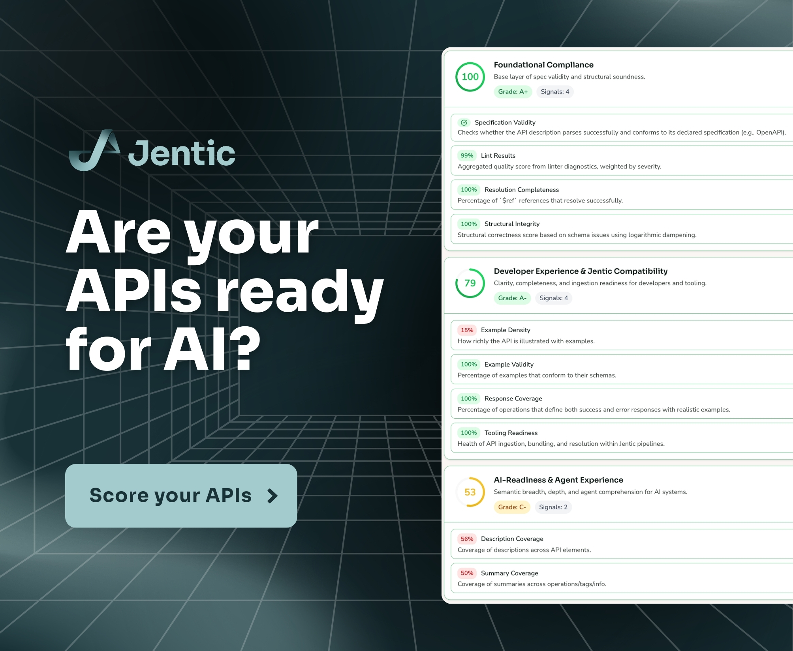

# Jentic API Scorecard



A spec that passes OpenAPI validation isn't necessarily one an AI agent can use. Grammar is one
thing; semantic clarity, safety, and discoverability are another. The Jentic API Scorecard measures
where your spec stands on the second question — scoring it against the
[Jentic API AI Readiness Framework (JAIRF)](https://github.com/jentic/api-ai-readiness-framework)
across six dimensions and returning a single grade.

The project ships in two pieces: the public Docker image `ghcr.io/jentic/jentic-api-scorecard`,
and an `@jentic/api-scorecard` npm CLI that orchestrates the image. Both are tracked in this
monorepo (`packages/cli/` for the CLI, `docker/` for the image). Per-phase progress lives in
[`specs/roadmap.md`](specs/roadmap.md).

## What it scores

Each spec is evaluated across six lenses — small, targeted improvements in any of them tend to
produce outsized gains for both human developers and AI agents:

- **Foundational Compliance (FC)** — structural validity and conformance to OpenAPI itself.
- **Developer Experience & Jentic Compatibility (DXJ)** — documentation quality and how well the
  spec plays with downstream tooling.
- **AI-Readiness & Agent Experience (ARAX)** — semantic clarity and the context an LLM needs to
  reason about each operation.
- **Agent Usability (AU)** — predictable, safe multi-step orchestration.
- **Security (SEC)** — declared auth schemes and trust boundaries.
- **AI Discoverability (AID)** — how easily an AI system can find and parse the spec.

## What it does

Pass an OpenAPI spec — by URL or by piping bundled JSON to the container — and the scorer evaluates
it across the six dimensions above and emits the result as JSON. Today the published Docker image
is JSON-only; piping its output to `jq` is the way to read a score:

```bash
docker run --rm ghcr.io/jentic/jentic-api-scorecard:unstable \
  score --url https://raw.githubusercontent.com/jentic/jentic-public-apis/refs/heads/main/apis/openapi/swagger-api/petstore/1.0.27/openapi.json \
  | jq '.summary | {score, level, grade, dimensions: [.dimensions[] | {kind, name, score, grade}]}'
```

Example output:

```json
{
  "score": 68.62,
  "level": "ai-aware",
  "grade": "B+",
  "dimensions": [
    { "kind": "FC",   "name": "Foundational Compliance",                     "score": 99.51,  "grade": "A+" },
    { "kind": "DXJ",  "name": "Developer Experience & Jentic Compatibility", "score": 68.89,  "grade": "B+" },
    { "kind": "ARAX", "name": "AI-Readiness & Agent Experience",             "score": 54.62,  "grade": "C"  },
    { "kind": "AU",   "name": "Agent Usability",                             "score": 93.70,  "grade": "A+" },
    { "kind": "SEC",  "name": "Security",                                    "score": 42.50,  "grade": "D-" },
    { "kind": "AID",  "name": "AI Discoverability",                          "score": 100.00, "grade": "A+" }
  ]
}
```

## How it works

Scoring runs locally inside the container in two phases. **Analysis** runs a battery of validators
and structural checks against the spec — and, with `--with-llm`, LLM-backed signals on top — to
produce a set of diagnostics and observations. **Scoring** maps those into ~35 signals across the six
JAIRF dimensions, aggregates them into per-dimension scores, and rolls those up into a single weighted
score and grade. Anonymous scoring is restricted to specs in
[jentic-public-apis](https://github.com/jentic/jentic-public-apis); other inputs require
`JENTIC_API_KEY=mvp-preview` (a documented public placeholder for the MVP preview, not a secret).

## Requirements

- **Docker** installed and running. See [Docker installation](https://docs.docker.com/get-docker/).
- Network access to `ghcr.io` (to pull the image) and to whatever URL hosts the spec you're scoring
  (the engine fetches it from inside the container).

## Quick start

### Score an allowlisted public spec

No key required (swap in any other path under
[jentic-public-apis/apis/openapi/](https://github.com/jentic/jentic-public-apis/tree/main/apis/openapi)):

```bash
docker run --rm ghcr.io/jentic/jentic-api-scorecard:unstable \
  score --url https://raw.githubusercontent.com/jentic/jentic-public-apis/refs/heads/main/apis/openapi/swagger-api/petstore/1.0.27/openapi.json \
  | jq '.summary | {score, level, grade, dimensions: [.dimensions[] | {kind, name, score, grade}]}'
```

### Score any other URL — set the MVP preview key

```bash
docker run --rm -e JENTIC_API_KEY=mvp-preview ghcr.io/jentic/jentic-api-scorecard:unstable \
  score --url https://petstore3.swagger.io/api/v3/openapi.json \
  | jq '.summary | {score, level, grade, dimensions: [.dimensions[] | {kind, name, score, grade}]}'
```

### Pipe a local spec via stdin

```bash
cat openapi.json | docker run -i --rm -e JENTIC_API_KEY=mvp-preview ghcr.io/jentic/jentic-api-scorecard:unstable \
  score \
  | jq '.summary | {score, level, grade, dimensions: [.dimensions[] | {kind, name, score, grade}]}'
```

## LLM-backed analysis

Add `--with-llm` to enable LLM-backed signal analysis. Forward at least one supported provider's
keys to the container with `-e <NAME>` — no `=value`; Docker copies the value from your shell at
run time, so the key never lands in your shell history:

| Provider    | Forward with                                                  |
| ----------- | ------------------------------------------------------------- |
| OpenAI      | `-e OPENAI_API_KEY`                                           |
| Anthropic   | `-e ANTHROPIC_API_KEY`                                        |
| Gemini      | `-e GEMINI_API_KEY`                                           |
| AWS Bedrock | `-e AWS_ACCESS_KEY_ID -e AWS_SECRET_ACCESS_KEY -e AWS_REGION` |

For AWS Bedrock with temporary credentials (e.g. `aws sts assume-role`, AWS SSO), also forward
`-e AWS_SESSION_TOKEN`.

By default the engine routes LLM calls to Bedrock-hosted Claude. To use a non-Bedrock provider you
must point the engine at it explicitly: set `LLM_PROVIDER`, `LLM_LIGHT_PROVIDER`, and pick an
`LLM_LIGHT_MODEL` for that provider. Without `LLM_LIGHT_MODEL` the engine falls back to a Bedrock
model ID and the run will fail for non-Bedrock providers.

Example (OpenAI, allowlisted public spec — no `JENTIC_API_KEY` needed):

```bash
docker run --rm \
  -e OPENAI_API_KEY \
  -e LLM_PROVIDER=openai \
  -e LLM_LIGHT_PROVIDER=openai \
  -e LLM_LIGHT_MODEL=gpt-4o \
  ghcr.io/jentic/jentic-api-scorecard:unstable \
  score --with-llm \
  --url https://raw.githubusercontent.com/jentic/jentic-public-apis/refs/heads/main/apis/openapi/swagger-api/petstore/1.0.27/openapi.json \
  | jq '.summary | {score, level, grade, dimensions: [.dimensions[] | {kind, name, score, grade}]}'
```


## Status

The GHCR image is the production-supported entry point — direct `docker run` is fully documented,
and the only published tag is `:unstable`. `:unstable` is rebuilt on every push to `main`. Docker
caches by tag name, so subsequent runs reuse your local copy — pass `--pull=always` when you want
the latest build.

```bash
docker run --pull=always --rm ghcr.io/jentic/jentic-api-scorecard:unstable \
  score --url https://raw.githubusercontent.com/jentic/jentic-public-apis/refs/heads/main/apis/openapi/swagger-api/petstore/1.0.27/openapi.json \
  | jq '.summary | {score, level, grade, dimensions: [.dimensions[] | {kind, name, score, grade}]}'
```

The `@jentic/api-scorecard` npm CLI (in `packages/cli/`) wraps the image with a friendlier
invocation and is built end-to-end against the published GHCR image. It currently streams the
engine's verbatim JSON to stdout — pretty / Markdown rendering, `--detail` / `--format` / `-o` /
`--quiet` / `--verbose`, and the `npx @jentic/api-scorecard` distribution itself land in later
phases.

## License

Jentic API Scorecard is licensed under the [Apache 2.0](LICENSE) license. Jentic API Scorecard comes
with an explicit [NOTICE](NOTICE) file containing additional legal notices and information.
